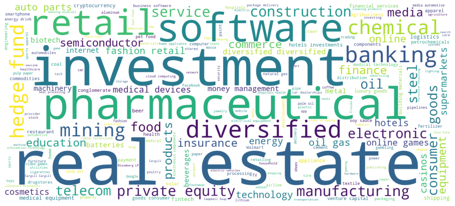
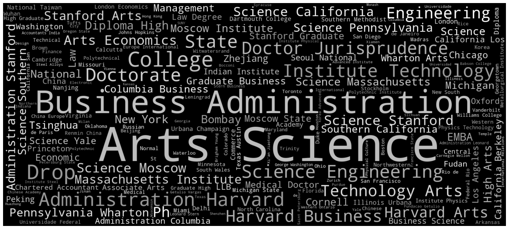

# Introduction
## Exploratory Analysis on Billionaires 2021
This dataset contains list of all the people categorized as Billionaires of 2021 by Forbes in their 35th Annual World's Billionaires List.

Project aims to explore insights at individual, country, source of wealth and education perspectives on these billionaires.

# Acknowledgements:

Thanks to Python and Web Scraping and of course Forbes Real Time Billionaires list.

Skimmed the data from forbes.com

With coordinates added with OpenCageGeocode

# Kaggle source: 
https://www.kaggle.com/alexanderbader/forbes-billionaires-2021-30?select=forbes_billionaires_geo.csv 

# Libraries
numpy, matplotlib, seaborn, wordcloud, geopandas, shapely,pltoly express

# Key Findings 
## Individuals:

Jeff Bezos is the richest among the list, standing at USD $177B. 

## Countries:

United States has the largest total amount of networths among all the billionaires. China comes next and Germany, India, Russia trail closely behind. 

## Industry

Real Estate, Pharmaceuticals and Investments are the industries to consider venturing into, if you ever wish to get lucky into the Forbes list. 

## Education

Many billionaires studied Arts, Science, Business in universities back then. Some did not have university degrees too. 

# Python ipynb
Full EDA analysis on: 

https://github.com/chekwei4/Forbes_Billionaire_EDA/blob/main/Forbes_Billionaire.ipynb
